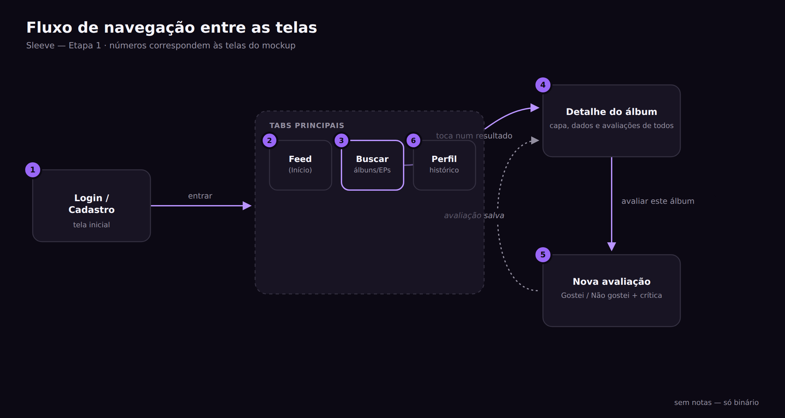
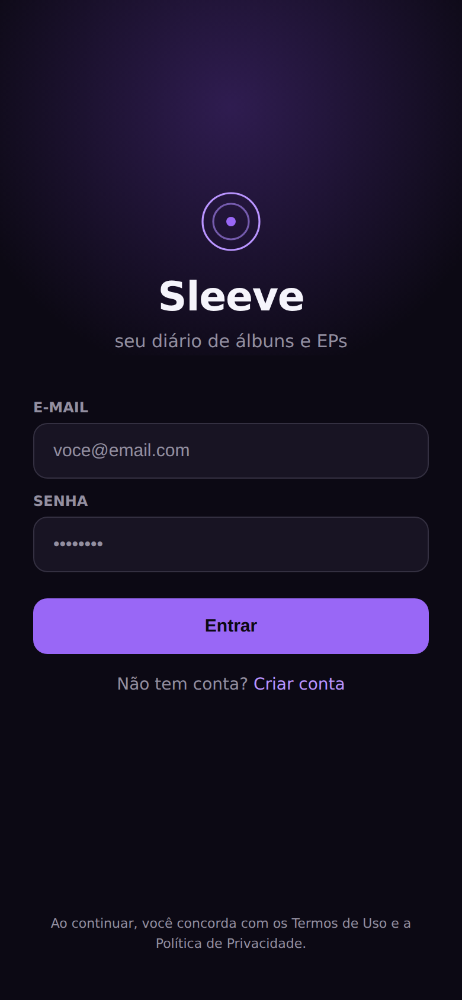
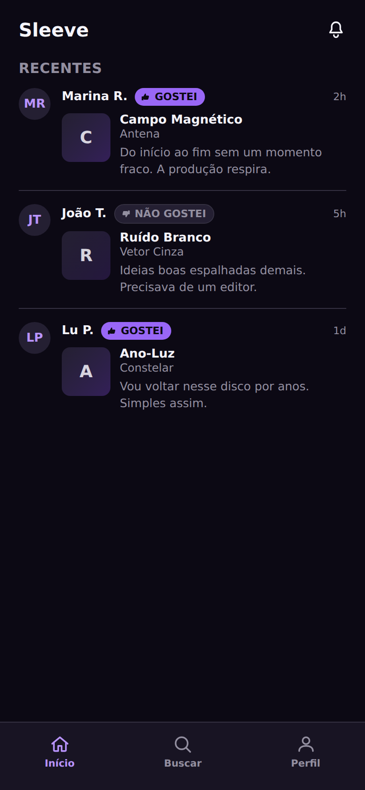
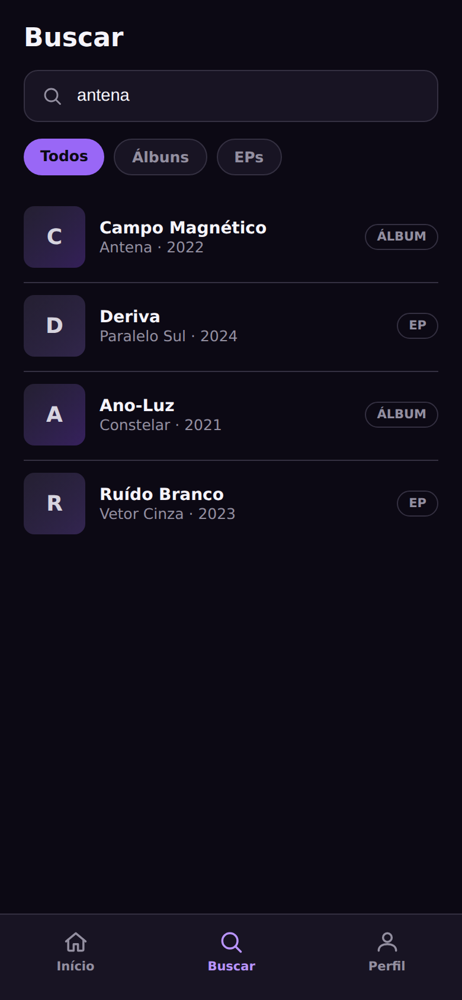
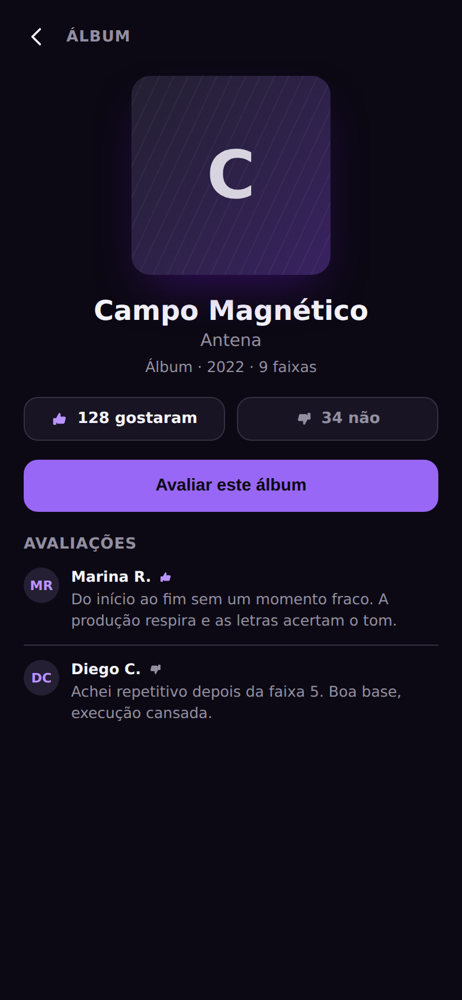
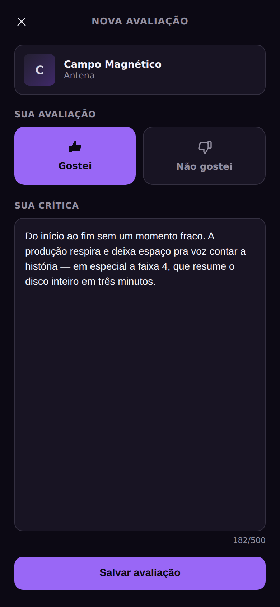
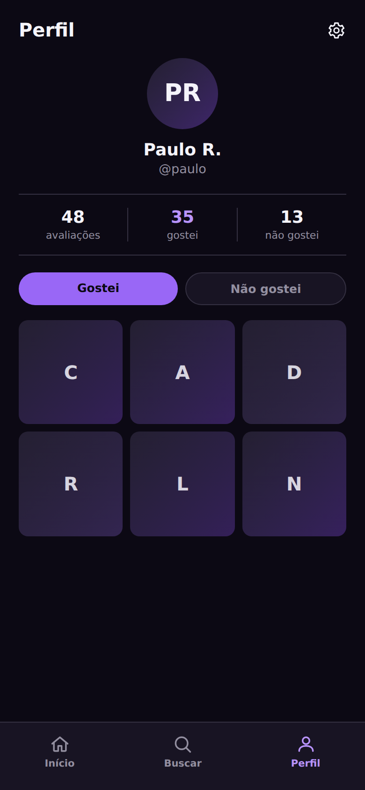

# Evidências — Sleeve

> Este arquivo reúne, a cada etapa, prints/gravações e uma breve descrição
> do que foi demonstrado em funcionamento.

## Etapa 1 — Proposta e planejamento

Projeto Expo criado e executável localmente (`npm install && npm start`),
com navegação entre as 6 telas previstas funcionando com dados placeholder
(ver `src/screens/`).

Mockups visuais das 6 telas e do fluxo de navegação entre elas (roxo e
preto, conforme a proposta), em `docs/mockups/`:

| Tela | Print |
|---|---|
| Fluxo de navegação |  |
| 1. Login / Cadastro |  |
| 2. Home / Feed |  |
| 3. Buscar |  |
| 4. Detalhe do álbum |  |
| 5. Nova avaliação |  |
| 6. Perfil |  |
